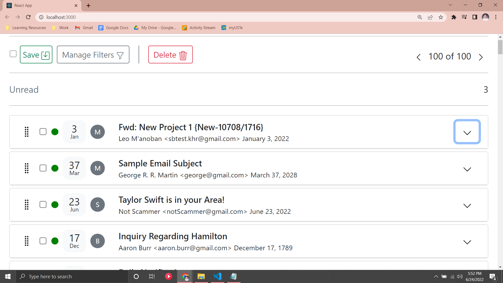
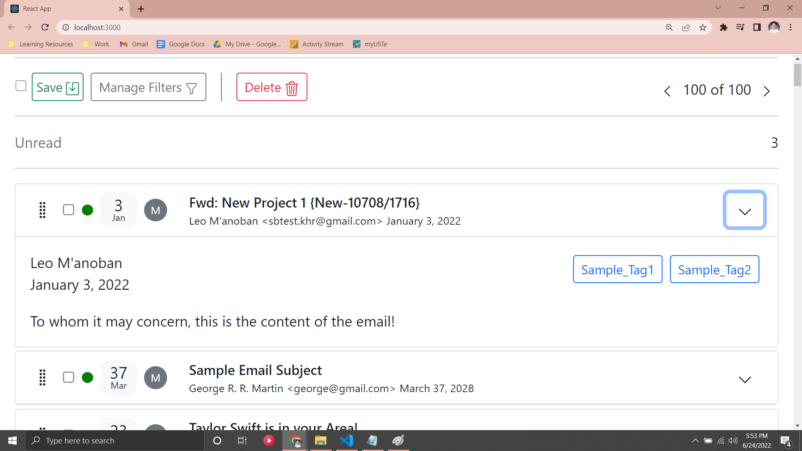

# Email React Application
This repository is a single page web-application of a list of emails and is a demonstration of my knowledge in ReactJs. It shows you a list of emails just like how you would see it through Gmail. I used the bootstrap framework to aid with the layouting and used json-server to store the array of email objects. Please excuse some of the content of the email objects, I used my creativity to fill up the dummy records with random information. I also only created 10 unique email information for the array and I copy pasted it 10 times. 

## Functionality
- You can delete emails by checking the checkbox button of the emails you are going to delete and then clicking the delete button

## Demonstration
The following pictures are demonstrate the what the website looks like when launched:

## Launch information

In order to run the project, first run the following code in the project folder using command line to start the json server:
### `npx json-server --watch Data/emailList.json --port 8000`

Then open the web page by running the code in the project folder using command line:
### `npm start`
